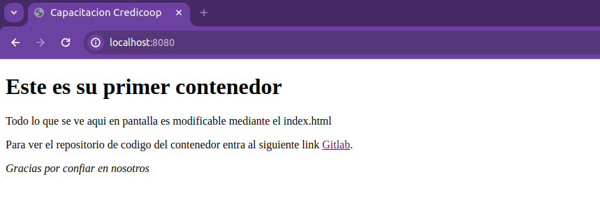

# Clase 1 

## Nube.
En el principio de los tiempos (ahi por 1960), las grandes empresas compraban grandes computadoras que ocupaban literalmente habitaciones, data centers con su propio sistemas de refrigeración. En estos sistemas ningun usuario veia la maquinaria ni interactuaba directamente con ella, los desarrolladores subian sus trabajos de manera remota y esperaban resultados de la maquina. Si eso suena como hoy con la nube es porque lo es, la idea de la nube es que en vez de comprar **computadoras** , compras **Computo.** Actualmente este modelo de trabajo tiene el nombre de infraestructura como servicio (IaaS).  
  
## Que tiene que ver nube con nosotros.
Pero, ¿Que tiene que ver la nube con lo que vamos a hablar nosotros?, la respuesta es simple, los contenedores solucionaron el gran problema del trabajo en la nube. El principal problema radica en que el desarrollador podia hacer una pieza de software que "funciona en su maquina" y al momento de pasarla a la infraestructura en la nube este software no funciona. La solución que se encontro en ese momento fue lo que hoy se conoce como **infraestructura como codigo**, ¿En que consiste la infraestructura como codigo?, en vez de levantar servidores fisicos con cables, levantamos maquinas virtuales, de esta manera podemos anticipar como va a ser la maquina donde se va a desplegar el software y trabajar acorde.  

## Contenedores.
Bien, tenemos una solución, pero como toda solución tiene un o mas defectos, en el caso virtuales tenemos unos pares:  
  
- Son pesadas de migrar y de "intercambiar"
- No son escabalables al largo plazo
- En el contexto nube es costoso levantar virtuales para cada servicio.  
  
Para correr una pieza de software, ademas del software en si, necesitamos todas las dependencias, subpaquetes, compiladores o interpretadores, configuración etc. Pensemos el **Contenedor** como eso, un contenedor, este contiene (y nunca mejor dicho) el software en si y todo lo que este necesita para funcionar. Pero que ventajas tiene usar contenedores:  
  
- Los contenedores corren directamente sobre el CPU real y no un cpu virtualizado.
- Se puede re-utilizar la misma imagen, vamos a ver que es una imagen mas adelante, de un contenedor para desplegar muchas copias del mismo, de esta forma estos son escabalables.
- El contenedor es siempre igual, por lo tanto el desarrollador no necesita mantener distintas versiones del mismo software para distintos entornos.
- Como los contenedores unicamente contienen la información que necesitan para funcionar son mucho mas livianos que las VMs.  

## Docker.
¿Que es Docker?, Docker es un set de herramientas, todas open source, a nosotros nos importan:
- Docker engine: El software que corre los contenedores
- Docker swarm: Software que permite la orquestación de contenedores de docker (desde docker 1.12 es parte de docker engine).
- Docker Volume: Facilita la persistencia de datos, permitiendo asi guarda la información aun si el container se muere o es recreado.  
  
El Engine de docker es quien nos va a permitir a nosotros generar nuestros propios containers.  

Para que vean como funcionan los contenedores, en vez de seguir hablando pavadas, vamos a los bifes.

1. Instalamos Docker
```bash
  $ sudo yum install -y yum-utils
  $ sudo yum-config-manager --add-repo https://download.docker.com/linux/rhel/docker-ce.repo
  $ sudo yum install docker-ce docker-ce-cli containerd.io docker-buildx-plugin docker-compose-plugin
```
2. Levantamos el servicio necesario para correr contenedores 
```bash
  $ sudo systemctl start docker
``` 
3. Corremos nuestro primer contenedor 
```bash
  $ sudo docker run -p 8080:80 juliancillo/credi-demo
```
4. Accedemos al localhost:8080 y deberiamos ver una interfaz web parecida a esta.  
  
  
  
## ¿Porque funciona esto?
Si entramos al hipervinculo del contenedor demo, podemos ver el codigo fuente de este container, tenemos 3 archivos:  
  
- El primero (README.md) es el archivo de la clase1 que estas leyendo en este momento.
- El segundo (index.html) es el codigo html de la pagina
- Y el tercero (DockerFile) es el archivo que usamos para crear contenedores de docker, este archivo contiene la instrucciones para que al levantar el contenedor tome el archivo index.html y lo ejecute en un servidor nginx.  
  
### Ejercicio
Modificar el arcivo "index.html" del repo y buildear la imagen con los cambios.
```bash
$ sudo docker build -t <nombre-de-la-imagen> .
```
Una vez buildeada la imagen correrla con el comando anterior llamando al nombre de la imagen actualizado.
